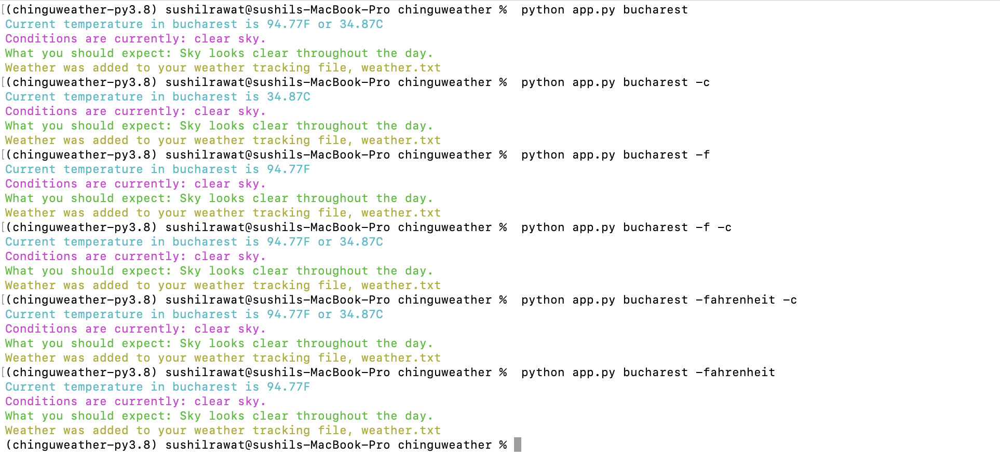

# **Weather CLI**

Get current weather conditions for any city directly from your terminal. This Python-based CLI tool fetches weather data using OpenWeather's API and provides an option to view temperatures in either Celsius or Fahrenheit.


**Features**

Fetch current weather conditions for any city globally.
Option to view temperature in Celsius or Fahrenheit.
Save the weather report to a local file (weather.txt) for tracking.

**Prerequisites**

Python 3.x
OpenWeather API Key (Get yours [here](https://openweathermap.org/api))

Mapbox API Key for geocoding (Optional, get yours [here](https://docs.mapbox.com/api/search/geocoding/#forward-geocoding))

**Installation & Setup**

1. Clone this repository:
````
git clone git@github.com:rawatsushil/chingu-weather.git
````

1. Install required Python packages:
````
pip install -r requirements.txt
````

1. Set up your environment variables in a .env file:
````
OPENWEATHER_API_KEY=your_openweather_api_key_here
MAPBOX_API_KEY=your_optional_mapbox_api_key_here
````

**Usage**

Fetch weather data:
````
python app.py <city-name> [-f | -fahrenheit] [-c | -celsius]
````
Examples:
````
python app.py Bucharest
python app.py Bucharest -f
python app.py Bucharest --fahrenheit
python app.py Bucharest -c
````
Output examples:


**Contributing**

Pull requests are welcome. For major changes, please open an issue first to discuss what you would like to change.


